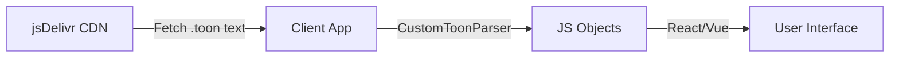

# Quran Toon Format Developer Guide

> [!NOTE]
> **Toon** stands for **T**ext **O**ptimized **O**bject **N**otation (a playful backronym). It is a custom text-based format designed specifically for the Quran API to maximize compression ratios (standard Gzip/Brotli) and minimize client-side parsing overhead.

## Introduction

The **Quran Toon API** allows frontends to render Quran data with significant performance improvements over standard JSON.
- **Smaller Transfer Size**: ~30-50% smaller than equivalent JSON due to removing repetitive keys.
- **Faster Parsing**: Simple CSV-like structure is faster to parse than full JSON object trees.
- **Granular Access**: Endpoints for Editions, Surahs, Verses, Juzs, Rukus, Pages, Manzils, and Maqras.

## Architecture & Data Flow

1. **DOWNLOAD**: Client fetches [.toon](file:///home/saboor/code/quran-api-toon-prep/info.toon) text file from CDN.
2. **PARSE**: Client uses the lightweight [CustomToonParser](file:///home/saboor/code/quran-api-toon-prep/benchmark-app/src/lib/CustomToonParser.ts#1-182) to convert text -> JS Objects.
3. **RENDER**: Client renders the data using standard UI libraries (React, Vue, etc.).



## API Reference

**Base URL**: `https://cdn.jsdelivr.net/gh/HsnSaboor/quran-api-toon@main`

### Endpoints

| Resource | URL Pattern | Description |
|----------|-------------|-------------|
| **All Editions** | `/editions.toon` | List of all available 300+ translations. |
| **Uthmani Script** | `/quran_data_toon/quran/...` | Standard Arabic script (granular files available). |
| **Tajweed Rules** | `/quran_data_toon/tajweed/...` | Tajweed rules (no text, invalidation layer). |
| **Translation** | `/editions/{edition_id}/...` | Translation text (granular breakdown). |

**Granular Breakdown** (available for `editions`, `quran`, and `tajweed`):
- Full: `/{id}.toon`
- Surah: `/{id}/{surah_num}.toon`
- Page: `/{id}/pages/{page_num}.toon`
- Juz: `/{id}/juzs/{juz_num}.toon`

**Examples**:
- **Uthmani (Surah 1)**: `.../quran_data_toon/quran/1.toon`
- **Tajweed (Page 1)**: `.../quran_data_toon/tajweed/pages/1.toon`
- **English (Sahih)**: `.../editions/eng-sahih/1.toon`

## Client-Side Implementation

### 1. The Parser Implementation

Copy this Typescript class into your project. It handles all Toon format variations.

> [!TIP]
> This parser is "zero-dependency" and efficient.

```typescript
// CustomToonParser.ts
export class CustomToonParser {
    static parse(toonString: string): any {
        const len = toonString.length;
        if (len === 0) return {};

        // 1. Key-Value map (starts with 'c:' or 'id:')
        if (toonString.startsWith('c:') || toonString.startsWith('id:')) {
            return CustomToonParser.parseKeyValue(toonString);
        }

        // 2. Info / Complex Nested (starts with verses: or meta:)
        // Primarily used for 'info.toon' or 'editions.toon'
        if (toonString.startsWith('verses:') || toonString.startsWith('meta:')) {
            if (toonString.includes('editions[')) {
                return CustomToonParser.parseEditions(toonString);
            }
            // Fallback for complex structure (e.g. info.toon)
            return { _note: "Complex header detected", length: len };
        }

        // 3. Standard Verse List / Chapter / Quran (quran[...])
        if (toonString.includes('quran[')) {
            return CustomToonParser.parseVerseList(toonString, 'quran');
        }

        return {};
    }

    private static parseKeyValue(str: string) {
        // Parses "key: value\nkey2: value2"
        const lines = str.split('\n');
        const obj: any = {};
        for (const line of lines) {
            const colon = line.indexOf(':');
            if (colon > -1) {
                const key = line.substring(0, colon).trim();
                let val = line.substring(colon + 1).trim();
                if (val.startsWith('"') && val.endsWith('"')) {
                    val = val.substring(1, val.length - 1); // Remove quotes
                } else {
                    const num = Number(val);
                    if (!isNaN(num)) val = num as any;
                }
                obj[key] = val;
            }
        }
        return obj;
    }

    private static parseEditions(str: string) {
        // Find split point between metadata and csv body
        const dataStart = str.indexOf('editions[');
        if (dataStart === -1) return [];

        const colonPos = str.indexOf(':\n', dataStart);
        if (colonPos === -1) return [];

        const start = colonPos + 2;
        const editions = [];
        const len = str.length;
        let i = start;
        let lineEnd = 0;

        while (i < len) {
            lineEnd = str.indexOf('\n', i);
            if (lineEnd === -1) lineEnd = len;
            if (lineEnd > i) {
                const line = str.substring(i, lineEnd);
                if (line.trim().length > 0) {
                    const parts = CustomToonParser.splitCSV(line);
                    // Order: id, author, lang, dir, src, note
                    if (parts.length >= 3) {
                        editions.push({
                            id: parts[0],
                            author: parts[1],
                            lang: parts[2],
                            dir: parts[3],
                            src: parts[4],
                            note: parts[5]
                        });
                    }
                }
            }
            i = lineEnd + 1;
        }
        return { editions };
    }

    private static parseVerseList(str: string, keyName: string) {
        // Parses "quran[...]:\n 1,2,\"text\"..."
        const len = str.length;
        const dataStart = str.indexOf(':\n');
        if (dataStart === -1) return { [keyName]: [] };

        const start = dataStart + 2;
        const verses = [];
        let cur = start;
        let lineEnd = 0;

        while (cur < len) {
            lineEnd = str.indexOf('\n', cur);
            if (lineEnd === -1) lineEnd = len;

            if (lineEnd > cur) {
                const line = str.substring(cur, lineEnd);
                
                // Check if it's a nested structure (e.g. "  - v: 1")
                // This happens in Tajweed files which have nested rules
                if (line.trim().startsWith('- v:') || line.trim().startsWith('- c:')) {
                     // For structured data like Tajweed, we recommend using the official 
                     // @toon-format/toon library OR a more advanced YAML-lite parser.
                     // A simple CSV splitter won't work here.
                     console.warn("Advanced nested structure detected. Use full parser.");
                     // SKIP or implement recursive parsing if needed.
                     // For plain text endpoints, this is skipped.
                     cur = lineEnd + 1;
                     continue;
                }

                const parts = CustomToonParser.splitCSV(line);
                if (parts.length >= 3) {
                    verses.push({
                        c: Number(parts[0]),
                        v: Number(parts[1]),
                        t: parts[2]
                    });
                }
            }
            cur = lineEnd + 1;
        }
        return { [keyName]: verses };
    }

    // Robust CSV splitter handling quotes
    private static splitCSV(line: string): any[] {
        const parts = [];
        let start = 0;
        let inQuote = false;
        const len = line.length;

        for (let i = 0; i < len; i++) {
            const char = line.charCodeAt(i);
            if (char === 34) { // Quote "
                inQuote = !inQuote;
            } else if (char === 44 && !inQuote) { // Comma ,
                let part = line.substring(start, i).trim();
                part = CustomToonParser.unescape(part);
                parts.push(part);
                start = i + 1;
            }
        }
        // Last part
        let last = line.substring(start).trim();
        last = CustomToonParser.unescape(last);
        parts.push(last);

        return parts;
    }

    private static unescape(val: string): any {
        if (val.charCodeAt(0) === 34 && val.charCodeAt(val.length - 1) === 34) {
            return val.substring(1, val.length - 1);
        }
        const num = Number(val);
        return isNaN(num) ? val : num;
    }
}
```

## Tajweed Rendering Guide

To render colored Tajweed, you must fetch **both** the Uthmani text and the Tajweed rules files for the corresponding section (e.g., Page 1) and merge them.

### 1. The Strategy
- **Uthmani**: [quran_data_toon/quran/pages/1.toon](file:///home/saboor/code/quran-api-toon-prep/quran_data_toon/quran/pages/1.toon) -> Provides the raw string.
- **Tajweed**: [quran_data_toon/tajweed/pages/1.toon](file:///home/saboor/code/quran-api-toon-prep/quran_data_toon/tajweed/pages/1.toon) -> Provides an array of rules `{s, e, r}`.

You simply overlay the rules onto the string using string slicing or by generating React nodes.

### 2. Implementation Example

```typescript
// Merges text with rules to create React elements
function renderTajweed(text: string, rules: { s: number, e: number, r: string }[]) {
    // 1. If no rules, return plain text
    if (!rules || rules.length === 0) return text;
    
    // 2. Sort rules by start index
    const sorted = [...rules].sort((a, b) => a.s - b.s);
    
    const elements = [];
    let lastIndex = 0;
    
    sorted.forEach((rule, i) => {
        // A. Add plain text before this rule
        if (rule.s > lastIndex) {
            elements.push(<span key={`text-${i}`}>{text.substring(lastIndex, rule.s)}</span>);
        }
        
        // B. Add the rule itself
        // Ensure we don't go out of bounds
        const end = Math.min(rule.e, text.length);
        const content = text.substring(rule.s, end);
        
        elements.push(
            <span key={`rule-${i}`} className={`tajweed-${rule.r}`}>
                {content}
            </span>
        );
        
        lastIndex = end;
    });
    
    // C. Add any remaining plain text
    if (lastIndex < text.length) {
        elements.push(<span key="text-end">{text.substring(lastIndex)}</span>);
    }
    
    return <>{elements}</>;
}
```

### 3. CSS Classes
You must define CSS classes for each rule returned by the API (e.g., `ham_wasl`, `madda_normal`, `ghunnah`).

```css
.tajweed-ham_wasl { color: #AAAAAA; } /* Grey */
.tajweed-madda_normal { color: #5377bf; } /* Blue */
.tajweed-ghunnah { color: #FF7E1E; } /* Orange */
/* ... etc */
```

## Schemas

### Verse Object (Uthmani/Editions)
Returned in lists (Surah, Page, Ruku, etc.).
```typescript
interface Verse {
  c: number; // Chapter ID (1-114)
  v: number; // Verse ID (relative to chapter)
  t: string; // The text content (Arabic/Translation)
}
```

### Tajweed Object (Tajweed Only)
Returned in lists for Tajweed endpoints.
```typescript
interface TajweedVerse {
  c: number;
  v: number;
  rules: {
    s: number; // Start index (inclusive)
    e: number; // End index (exclusive)
    r: string; // Rule name (class)
  }[];
}
```
